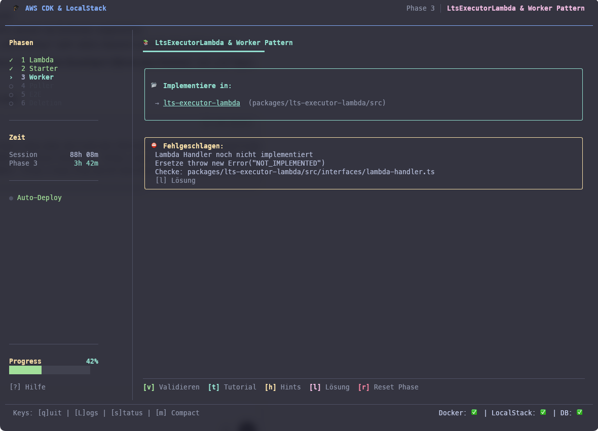

# AWS CDK & LocalStack Workshop

A terminal application that teaches serverless patterns by making you build
them. Participants implement a database archival system on Lambda, SQS and
PostgreSQL, phase by phase, while the CLI deploys their code on every save
and validates each step against real infrastructure. Everything runs on
LocalStack. No AWS account, no cloud bill, nothing to click.

I built this for a full-day workshop I teach (in German). The tooling turned
out to be the interesting part, so here it is under MIT.


## Quick start

You need Node.js 20+, pnpm and Docker Desktop.

```bash
pnpm install
npm run workshop
```

The CLI boots LocalStack and PostgreSQL, deploys the CDK stack and drops you
into phase 0. If anything is ever broken beyond repair:
`npm run workshop reset`.

## What it feels like

Your editor and one terminal. You save a file, the CLI builds, bundles and
deploys the lambda, runs a smoke test and tells you what happened, with error
hints that link straight to the failing line. When your fan-out finally works,
you watch it on the live dashboard:

```
                 ╭────────────────────────────────────────────────────────╮
                 │  Worker + DLQ | Async Processing mit Fehlerbehandlung  │
                 ╰────────────────────────────────────────────────────────╯

                 ┌─────────┐         ┌─────────┐         ┌────────────────┐
                 │ TRIGGER │o───────>│ STARTER │────────>│     QUEUE      │
                 │  [ • ]  │         │  [ • ]  │         │  .:-=+#+=-:.   │
                 └─────────┘         └─────────┘         │     42 (3»)    │
                                                         └────────────────┘
                                                                 │
                                                                 o
                 ┌─────────┐         ┌─────────┐                 │
                 │   DB    │<───────o│ WORKER  │<────────o─────o─╯
                 │  [ • ]  │         │  [ • ]  │
                 └─────────┘         └─────────┘
                                          x
                                          v
                                     ┌─────────┐
                                     │   DLQ   │
                                     │   x 2   │
                                     └─────────┘
```

That is a real frame from the render tests, transliterated to characters
browser fonts keep monospaced (the terminal gets double borders and a
block-element sparkline). The particles move, the sparkline is the queue
depth over time, the DLQ blinks when a poison pill lands. There
is a chaos button that injects broken messages so you can watch the retry
machinery do its job.

Phase 1 ends with a locked door: to unlock phase 2 you have to break a
working lambda on purpose, read its CloudWatch logs, and find the secret it
leaks on error. Debugging as a rite of passage.

<a href="docs/images/validation.png"></a>

## What you build

```
                    ┌─────────────────┐
  API Request ────> │ MarkingStarter  │ ────> SQS Queue
                    │   (Fan-Out)     │           │
                    └─────────────────┘           │
                                                  v
                                         ┌───────────────┐
                    ┌──────────────────> │  LtsExecutor  │ <─┐
                    │                    │   (Worker)    │ ──┘ Self-Trigger
                    │                    └───────┬───────┘
                    │                            │
               SQS Queue <───────────────────────┤
                    │                            │
                    v                            v
           ┌─────────────────┐          ┌──────────────┐
           │  StatusPoller   │          │  PostgreSQL  │
           │ (Exp. Backoff)  │          └──────────────┘
           └─────────────────┘
```

| Phase | You |
|-------|-----|
| 0 | Learn CDK basics in an interactive tutorial |
| 1 | Read a finished lambda, then break it (see above) |
| 2 | Implement the fan-out starter: one request, N queue messages |
| 3 | Implement the self-triggering worker that batches through millions of rows |
| 4 | Implement status polling with exponential backoff via SQS delay |
| 5 | Debug a sabotaged system using nothing but structured logs |
| 6 | Write the CDK construct yourself, no training wheels |

Phases 2 to 4 ship as skeletons with numbered TODOs. Reference solutions live
in `solutions/` and can be diffed and applied from inside the CLI, but the
solution view only unlocks after you have seen all three hint levels. Every
lambda follows hexagonal architecture with a `Result<T, E>` error model, so
the use cases are unit-testable without any infrastructure.

## The workshop tests itself

`pnpm --filter workshop-cli run e2e` plays the entire workshop like a
participant: deploys the stack, applies the solutions phase by phase, runs
every validator, watches a real fan-out reach COMPLETED in the database and
proves the backoff by observing delayed messages in the status queue. Then it
restores the skeletons.

Writing that script paid for itself on the first run. It caught, among other
things:

- `localstack/localstack:latest` requiring an auth token since the 2026.3.0
  release, which would have killed the workshop for every participant with a
  fresh pull (the compose file now pins 4.9.2, the last community release)
- the Postgres entrypoint silently ignoring mounted SQL subdirectories, so
  every fresh setup had a schema with no tables in it
- the lambdas overriding the endpoint LocalStack injects into their
  containers with a baked-in `localhost:4566`, the exact
  localhost-inside-a-container trap the workshop itself teaches in phase 0
- and one measurement instead of a bug: a poison pill takes about 45 minutes
  to reach the DLQ with a 900 second visibility timeout and three receives.
  The live demo script was rewritten around that number instead of waiting
  on stage.

Beyond that there are 188 unit tests, including ones that assert dashboard
particles flow in the direction of the arrows, that the connector columns
line up to the character, and that quiz answer indices stay in range.

## Repository layout

```
packages/
  workshop-cli/            the CLI (React Ink)
  get-table-list-lambda/   phase 1 reference implementation
  marking-starter-lambda/  phase 2 skeleton
  lts-executor-lambda/     phase 3 skeleton
  status-poller-lambda/    phase 4 skeleton
  deletion-starter-lambda/ phase 6 stretch goal
  contracts/               shared types, ports, Result<T, E>
  database-adapter-postgres/
  queue-adapter-sqs/
cdk/                       infrastructure stack + assertion tests
solutions/                 reference implementations for phases 2 to 4
local/                     docker compose (LocalStack 4.9.2, PostgreSQL 16)
```

## Notes

The workshop content (tutorials, hints, quizzes) is in German; code and docs
are English. If you would like an English version of the content,
[open an issue](../../issues). Enough interest will make it happen.

This is teaching material. The patterns are built by hand on purpose, so that
participants understand what Step Functions, EventBridge and X-Ray would
abstract away. The production gaps (credentials in env vars, no encryption,
no alarms) are pointed out during the workshop rather than papered over.

Useful keys inside the CLI: `t` tutorial, `h` hints, `l` solution diff,
`L` live lambda logs, `?` cheat sheet and glossary.

MIT, see [LICENSE](LICENSE).
